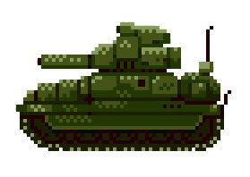

# Tankwarz


This is a little game I made for requirement purpose.


This online game allows you to code your tank behaviour with javascript and fight against competitors all around the world!


Learn the basics of the game, train by battling against random bot, and take up the main page permanent ruffle!


**Load up your tanks, clean your keyboards and get started!**

## The rules

* The first rule of tank war is do talk about tank war
* The game is round based, and your action choice is UP, DOWN, RIGHT, LEFT or SHOOT
* You have a limited number of rockets so use them wisely
* You have information about you, your ennemies and the rockets on the board
* One rocket hit, and you are dead (no multi-lives bullshit)
* You win by killing all your ennemies

## Basics


Your whole IA lives in a javascript function. This fonction take an argument parameter, that encaspulate all the datas you need to know about the state of the board. The programm expects you to return a command, in the form of a string

Your options are:

* UP : moves the tank one case upward
* DOWN : moves the tank one case downward
* LEFT : moves the tank one case to the left
* RIGHT : moves the tank one case to the right
* SHOOT : launch a rocket in the direction you were facing

If you dont send an order or your order does not fall within one of these options, your tank will do nothing. If you send an impossible order (run over another tank or shoot when you are out of missiles), your tank will do nothing. If your programm takes more than 500ms to answer, tour tank will explode!

## Getting the Data


To make the most of this little brain of yours, you will need some data to work on. At each turn, your fonction get sent some pretty usefull data!

The data is a javascript object, organised as followed:

    Data: object
        BULLET : int
        HISTORY: array
        X : int
        Y : int

    Ennemies : array of objects
        DEAD: boolean
        HISTORY : array
        X: int
        Y: int

    Missiles : array of objects
        DIR : direction
        X : int
        Y : int

The easiest way for you to test it is to print it to your console. Open the devTools (F12, Ctrl + Shift + I or Cmd + Opt + I) an run the next simulation where console.log(arg); has been added


## Server

The game will work by itself as a static HTML. However, if you want to setup a server for code submission, you need to use the server. This is a redit backed npm server, than runs live combat and score users using a ELO-scoring.

To run:

```
cd server
npm i && node server.js
```

To install redis and run the default one (not advised)

```
brew install redis
redis-server

``
